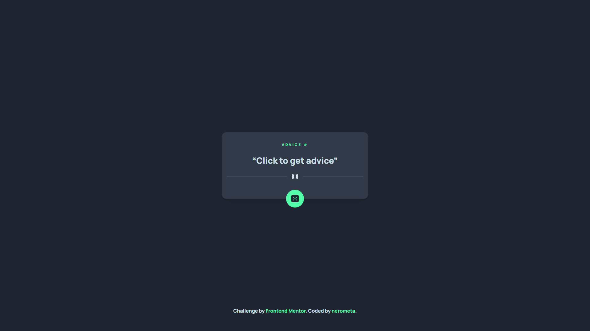

# Frontend Mentor - Advice generator app solution

This is a solution to the [Advice generator app challenge on Frontend Mentor](https://www.frontendmentor.io/challenges/advice-generator-app-QdUG-13db). Frontend Mentor challenges help you improve your coding skills by building realistic projects.

## Table of contents

- [Frontend Mentor - Advice generator app solution](#frontend-mentor---advice-generator-app-solution)
  - [Table of contents](#table-of-contents)
  - [Overview](#overview)
    - [The challenge](#the-challenge)
    - [Screenshot](#screenshot)
    - [Links](#links)
  - [My process](#my-process)
    - [Built with](#built-with)
    - [What I learned](#what-i-learned)
    - [Useful resources](#useful-resources)
  - [Author](#author)

## Overview

### The challenge

Users should be able to:

- View the optimal layout for the app depending on their device's screen size
- See hover states for all interactive elements on the page
- Generate a new piece of advice by clicking the dice icon

### Screenshot



### Links

- [Solution URL](https://www.frontendmentor.io/solutions/solution-advice-generator-app-with-angular-bootstrap-scss-CkjY71DifG)
- [Live Site URL](https://nerometa.github.io/advice-generator-app-challenge/)

## My process

This is my first FrontendMentor project using frontend framework (I use Angular). Initially, I wanted to make everything into a small chunk of component, then combined it together, but honestly I don't know how 🤣 so I coded everything in an app component.

This project is also the first to use API, so I made use of `HttpClient` module to handle my API request from [AdviceSlip](https://api.adviceslip.com). But first, I had to build `Quotes` model to receive API response

```ts
export interface Quotes {
  slip: QuotesData;
}

export interface QuotesData {
  id: number;
  advice: string;
}
```

I then generated a service to get request for an advice, which will send response in a `Quotes` model

```ts

getQuotes() {
    return this.http.get<Quotes>(`https://api.adviceslip.com/advice`);
}

```

This service has to be use within app, so I imported my quote service into constructor, then code a function around it, subscribe to changes, assign response to a variable, then interpolated it in an app.

```ts

  shuffle() {
    return this.quote.getQuotes().subscribe({
      next: (res) => {
        this.quotes = res;
      },
    });
}

```

I checked if there's no quote, it'll display "Click to get advice", otherwise it'll display whatever advice I requested, which somehow cached more than 2 seconds.

```html
<q class="card-text">
  {{ !quotes ? "Click to get advice" : quotes!.slip.advice }}
</q>
```

### Built with

- Angular
- HTML
- SCSS
- Flexbox
- Bootstrap

### What I learned

One of the basic topic in Angular is of course [Event Binding](https://angular.io/guide/event-binding) which has this syntax:

```html
<button (click)="onClick()"></button>
```

The `(click)` here is one of many target events. It, of course, listens for the button click. The `onClick()` is the method called when you click on a button.

Now, if you're working with API using Angular framework, `HttpClient` will help you with that. It's almost like Fetch API in JavaScript (I might be wrong, please take this with a grain of salt.)

---

Big, BIG think I learned how to do is deploying the app itself. I spent like 3-4 hours trying every single tutorial I can find. Found out that I need to use [angular-cli-ghpages](https://github.com/angular-schule/angular-cli-ghpages) for this, although some of the code didn't work.

Firstly, I had to `git remote origin` my project and then push it. After that, do `npm install angular-cli-ghpages`.

To actually build an app for production, I used this command: `ng build --configuration=production --base-href="https://<username>.github.io/<your-github-project-name-here>/"`. Make sure you replace `<username>` and `<your-github-project-name-here>` with yours.

Finally, use this command: `ngh --dir dist` or `ngh --dir dist/<project-name>` if you build with subfolder in it.

---

A little thing: Before you build your app, whatever source is in your `` tag, make sure **NOT** to write your filepath like this:

```html

```

Instead, do this:

```html

```
your app will still find your image or icon, even after you build it.

### Useful resources

- [Angular HttpClient](https://angular.io/api/common/http/HttpClient) - This is a staple for working with API in Angular.
- [Angular Event Binding](https://angular.io/guide/event-binding-concepts) - To this day, I'm still trying to understand how it works. What is input and output, how to pass data between child and parent. How to bind data, etc.
- [angular-cli-ghpages](https://github.com/angular-schule/angular-cli-ghpages) - If you wanna deploy your Angular app on Github Pages, use this thing.

## Author

- Github - [nerometa](https://www.github.com/nerometa)
- Frontend Mentor - [@nerometa](https://www.frontendmentor.io/profile/nerometa)
